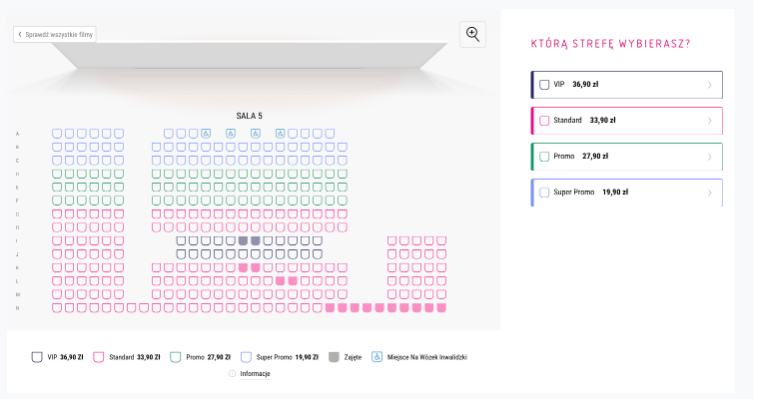
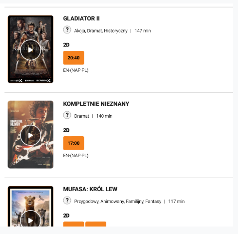

# CinemaChain -- Projekt OOP

## Opis projektu

Projekt realizowany w ramach programowania obiektowego.\
System symuluje działanie sieci kin (CinemaChain) z wykorzystaniem zasad
OOP (enkapsulacja, dziedziczenie, polimorfizm, abstrakcja).

## Uruchomienie

1.  Sklonuj repozytorium.
2.  Otwórz projekt w IDE.
3.  Zbuduj projekt.
4.  Uruchom klasę z metodą `main`.

------------------------------------------------------------------------

## Diagram UML

> **[![](https://img.plantuml.biz/plantuml/dsvg/ZLTBRziu4BuRy7yGVDdTjX6Qgv0rAZ_I61l7XkG6wAbWf8dDZIGQ99N0sUr_NpubKfAzpINYp3TFpWp7NnX7bDTbCHxz5lmv_2TPSrn1YUO7XAlWAiWnsbDK1Yy5Oi7lJ_0UbC19_iT59UCHUy7L4Kd1J0Yoc7EAdseEgunKANw7uFDuTC0v11ccMG7c0EMHduI1yWaeasgEA7j1UmWcnoA4l0xH_X2-rnIz2Vr7J3WDC-Lj9hsT1F-CHu4s6Aob-pStK75wEX9SyUbqFFhfwSn9AK1XNzRDW2878X4uZu9KH57jBKK9Fg0IUWmbpoBXnF56ipuPfLEBASah1W6vnupVhEMXOMKruwGK6UWeCEG6nt7s0fpDJdEIWu_TAPP2_ZmJzYjKDGo4VIdYQY1ObESK6EkIAI6b3UyE5KNZDSieG2MGbfjQWdMtzKWAjluCMMU0UAD8V4_zEuXCK3tD4YlAWq96Q3wTMYCVXTzllesFGLNBUem2KKIMb24EUq9FaL8qDoV7YaXkwV6iXSVLLd-ak_XX4ISBVTecc_N6CBvjbycFXd3k_eGBg21xl-Xb7Gs6nJ4le1jOBZg9OrAjSILQataHxg6YJNr-bOUfPGal4c12KoQ56oatSYLWhQVprO_RbVwUhJPVatXxzrqVvvlrSc6-u_bkjNamtm-hTTmUR-Frwjx05acyZlNdtIhTRPBLFBw_c2ZJDtwj6-AbQd_6bF6X_XOQ1kcYq73H9PAtIdUZJUOlz6RJ8vxFJQEqJgif4kbxjxI3Q9f8jKuJ6dl4noXu8gG0LBNKtK4eNFGOwftOOHdVFSbGiH0bB8-MVnGtBxpOaW9deWEsxj7jIqaiKALxn1mQFYdotQ_EBxzjZQOs2T9MoX6lEmCpRUZDL10b3VGLyjbfyrO1_GjE7H7rlmDNFSBEYIGjfcScvhEJ6WAz0Bt43jdRSN692zEWGuD5HsQpS9iib_ehMQRBv75fvagwkLzSgZHnzI_TEdCY6fmbfCc3FqwOYRIPnsuonSoaWYzpCb1MPni15S0yvtHbj9UVgTHs7WNRA57RCswnw8fq6bHETpiHUZMdBMvhAjvxTcwwIaXae9Og-qJuDiFx1MIuHCLWfAQRJ91YbW9zHXbqswhrPm7Fg2wuns_pyIHyb2ompU2yGPySNzejGWs1L8L7zpr_9UGL7viydWNQm2xkbWaKAFiR_cTvTFUloVKa85TNmUJ3n2ueaLsmpYFrGnW5vf6iuO9I-n94xU9r7ctABp9Ndi1UL3ezjLuhz0U3LljBf7SX3s3LjICzSXQZyKW9kfhKlXBfTSUo1VdgQgfWdSn8TrhLBj0cfjGlnZ38k7rGJuW3iVvSJxn17BdJlYjWTVhb6lcFI5UebstdkL2nETPTl3kv8czwIocZpOrqCF_3oFO2-lpFONZjLPAQAHRNZ0vNNwUGR5IAx--K-ieaNMrLVlGMhby3gMLmF8JXlzF-H56_aS9mwlxWaVGlKENYT-9_)](https://editor.plantuml.com/uml/ZLTBRziu4BuRy7yGVDdTjX6Qgv0rAZ_I61l7XkG6wAbWf8dDZIGQ99N0sUr_NpubKfAzpINYp3TFpWp7NnX7bDTbCHxz5lmv_2TPSrn1YUO7XAlWAiWnsbDK1Yy5Oi7lJ_0UbC19_iT59UCHUy7L4Kd1J0Yoc7EAdseEgunKANw7uFDuTC0v11ccMG7c0EMHduI1yWaeasgEA7j1UmWcnoA4l0xH_X2-rnIz2Vr7J3WDC-Lj9hsT1F-CHu4s6Aob-pStK75wEX9SyUbqFFhfwSn9AK1XNzRDW2878X4uZu9KH57jBKK9Fg0IUWmbpoBXnF56ipuPfLEBASah1W6vnupVhEMXOMKruwGK6UWeCEG6nt7s0fpDJdEIWu_TAPP2_ZmJzYjKDGo4VIdYQY1ObESK6EkIAI6b3UyE5KNZDSieG2MGbfjQWdMtzKWAjluCMMU0UAD8V4_zEuXCK3tD4YlAWq96Q3wTMYCVXTzllesFGLNBUem2KKIMb24EUq9FaL8qDoV7YaXkwV6iXSVLLd-ak_XX4ISBVTecc_N6CBvjbycFXd3k_eGBg21xl-Xb7Gs6nJ4le1jOBZg9OrAjSILQataHxg6YJNr-bOUfPGal4c12KoQ56oatSYLWhQVprO_RbVwUhJPVatXxzrqVvvlrSc6-u_bkjNamtm-hTTmUR-Frwjx05acyZlNdtIhTRPBLFBw_c2ZJDtwj6-AbQd_6bF6X_XOQ1kcYq73H9PAtIdUZJUOlz6RJ8vxFJQEqJgif4kbxjxI3Q9f8jKuJ6dl4noXu8gG0LBNKtK4eNFGOwftOOHdVFSbGiH0bB8-MVnGtBxpOaW9deWEsxj7jIqaiKALxn1mQFYdotQ_EBxzjZQOs2T9MoX6lEmCpRUZDL10b3VGLyjbfyrO1_GjE7H7rlmDNFSBEYIGjfcScvhEJ6WAz0Bt43jdRSN692zEWGuD5HsQpS9iib_ehMQRBv75fvagwkLzSgZHnzI_TEdCY6fmbfCc3FqwOYRIPnsuonSoaWYzpCb1MPni15S0yvtHbj9UVgTHs7WNRA57RCswnw8fq6bHETpiHUZMdBMvhAjvxTcwwIaXae9Og-qJuDiFx1MIuHCLWfAQRJ91YbW9zHXbqswhrPm7Fg2wuns_pyIHyb2ompU2yGPySNzejGWs1L8L7zpr_9UGL7viydWNQm2xkbWaKAFiR_cTvTFUloVKa85TNmUJ3n2ueaLsmpYFrGnW5vf6iuO9I-n94xU9r7ctABp9Ndi1UL3ezjLuhz0U3LljBf7SX3s3LjICzSXQZyKW9kfhKlXBfTSUo1VdgQgfWdSn8TrhLBj0cfjGlnZ38k7rGJuW3iVvSJxn17BdJlYjWTVhb6lcFI5UebstdkL2nETPTl3kv8czwIocZpOrqCF_3oFO2-lpFONZjLPAQAHRNZ0vNNwUGR5IAx--K-ieaNMrLVlGMhby3gMLmF8JXlzF-H56_aS9mwlxWaVGlKENYT-9_)**\
> Skrócony UML

> ** [![](https://img.plantuml.biz/plantuml/dsvg/jHZRRXf7z1s9VnZv9P0OshokN1GC944r1W5rL5LLD5x6ouJT7JGxQnUtUQdKh-XdzBLlRVwhPwuxUu54QU87F7FkSwup-o8Jc8iyYTkj9-YxvZ-96j6K97YqnJH5FRIXEE8uGRiOPoSPswriHzCzbiGX46T38JYzpGMPXYnTqKU2lcstjdH3K4Xv61Ep8SbU7512abl2Codc2UhrUcY1TvG0elCOiKrA2GB-JF1y9tB-xnzepzax0kkk96wtzZZSuOYWittS9vkyZwDj_p7d-05isbCcU3zKfmhbgSxGh-qMqaQYcJpcnGL91J_i6Kt5OD1klPTsE9aRbW1HlyxhUqg14JYCRWAqWfEdaOKenckSa1f2yMS16B6_qAXp8tHWQH9sJmcGND5CNCpang72F1Ci0QzL11YmenCqt16HNHv6R4FAj6k5CfJF4DvijFgEDYqmrdGj0ISHs46urT6nDWHERTSJfkpjg2E0NldFOM_pWrQUTRAG4vA2FU0Vkpn7TSddA2DOo4DarfC_FVsvQtoZfIro3kxEoA2kPvYzoaacZgZxNwBVKB5Tinr9ZmWN4cS5VvQkEvfkD4g7iHEgM6fsuDKuIVt-IFhUapGd3UbxAdFJXgI5i7AIPLKmPoonQVeQnx7BFkSHYtL-yTDEidIsy1CWkVIJoD4tEjTHHk0rpcIlIiXBng_9B-8D8RjEjr6jSf5rXDHOkA7fq39YpdvO3yebREl4jngeEf8DHC5ljwPKGg7nS18olXaCh7weCVPGLlyCfRdiZW62zcH18HOaOloWnO_CpdE6ofAkByceXpn8IanMzSrqeHUhzV1wF5oEzMwndC_c1l73Oh9ywm37KWrimp6BodrMLd_ZUGKLCQcUU0FDMr2MpcWA4oGh7JqYANSjyPNS59aKaINKEAUXP7PS_iaLWzM-6atVlfpgzULq_cevNBp-KMz7yzbaRDR3qNewlpRhw-biM6nV3cVJAqCsNWvdGxryFLsjvylfQ7Xrqb6civNBqW1F5UOTvPbe6YaWeH4EoKdZAf0zfAQ1bPgFNvTpIzBHKyHs6h_imEE4twjmPL1vpMLgYqSPC3Zb5CTUyegJLBZ5doiMLhGGvxpiXku3TCjOJ71QGDTR43Yk8TGbQKsb1wzOYECn58dSMlmUSWkiMB2OXb1y2t_hTmi9Z76gozDi79x5ffb_ob3cohq418GaQnYuH-P9C_kHqLCklcAmGJXFZFelDP2_W91Y0d-5MQjJVtHiufeoa85U2IpomiiUUO5jd0GcGuhapXnzEJaAEMu6cGXlBWzGhOH_JmuLbgBc2d9ThiTOl9AkgHc2MrRkW3vNgM2QzAq55EVOjFPAWdQOi-Hax5npoiMMSNXMsFYv19tN14KoHUfWMkGEoyLQ9uxf1n_Hdc2-Mq4PrqFzcHbHU497PfNYVRPbGexm4OjZeYRQHJKmrPck1TeqUhcSJFHgELbDbZSJCz9NywlngHOCFjXL6x2dkN6CLyDduPuRgnD0tMCuu6LIDVJRenC2noGh6QUBiQWU_tPSkuXwOyclDXqHRpRwhUvJBbQ-AJOfZznu_55geNAoWD6ND1gJa2OuRdI1cJ_cz72_8VmEEdjv41MgmADX7eDF9Pvu5z9pT4_tgy8bBkr5UIvs6omg3ZicTpYFHQFo7he51oYzjeTvbyvpJspnKbMwLyftFAevGvBuLfyWX1kaCKtP9EFLPEjNTTDx_JNZnAUM9O6f_8wW3ivO-4ujlq4xbkpPuq5le3fY-YWntOzyVIb_kC4HFDLp415z-FsVlo2N4Ob9Gb9nG51498MJ--HdpyyGw_NGsTCp-omCxEU9uvJwJXyWSz_FoGcXzb8R59yjZbERSWvCfIpLLmVvkf77l94FMSkhs9uQDlME2_HJj4HWvHQNoC1xbxPRYj6Nf1vdWNxsMJI0Uxs18gkuIDlbDPL2ZyzbtPNe2sipaJd3LjrWFH9htFEpqdqXy2-RLGOhiroUGVaEMsMgnS2xhPg3UlefPEWZuGyoGq6IX_5b-RCZA8qv8r4sz7RBgFJTqHYnPieYP7Nyj_t-yr8IglPkwLopzkLLSb0REe4vcq5PYiF-W1xWfS0-_1bIVN35MNwCwuXBk7frbXraoUqTGCetaMgt6Xjhl__ReFhYa5pg6sRd4PpuuUzKMOHodeTRbb3m5tkGlKFHzFi3lqlKe1v0Fw7SLez6jpLlhW9TXAOGwKQd0zc1Lm5O_ylJl23f9a_Y_m00)](https://editor.plantuml.com/uml/jHZRRXf7z1s9VnZv9P0OshokN1GC944r1W5rL5LLD5x6ouJT7JGxQnUtUQdKh-XdzBLlRVwhPwuxUu54QU87F7FkSwup-o8Jc8iyYTkj9-YxvZ-96j6K97YqnJH5FRIXEE8uGRiOPoSPswriHzCzbiGX46T38JYzpGMPXYnTqKU2lcstjdH3K4Xv61Ep8SbU7512abl2Codc2UhrUcY1TvG0elCOiKrA2GB-JF1y9tB-xnzepzax0kkk96wtzZZSuOYWittS9vkyZwDj_p7d-05isbCcU3zKfmhbgSxGh-qMqaQYcJpcnGL91J_i6Kt5OD1klPTsE9aRbW1HlyxhUqg14JYCRWAqWfEdaOKenckSa1f2yMS16B6_qAXp8tHWQH9sJmcGND5CNCpang72F1Ci0QzL11YmenCqt16HNHv6R4FAj6k5CfJF4DvijFgEDYqmrdGj0ISHs46urT6nDWHERTSJfkpjg2E0NldFOM_pWrQUTRAG4vA2FU0Vkpn7TSddA2DOo4DarfC_FVsvQtoZfIro3kxEoA2kPvYzoaacZgZxNwBVKB5Tinr9ZmWN4cS5VvQkEvfkD4g7iHEgM6fsuDKuIVt-IFhUapGd3UbxAdFJXgI5i7AIPLKmPoonQVeQnx7BFkSHYtL-yTDEidIsy1CWkVIJoD4tEjTHHk0rpcIlIiXBng_9B-8D8RjEjr6jSf5rXDHOkA7fq39YpdvO3yebREl4jngeEf8DHC5ljwPKGg7nS18olXaCh7weCVPGLlyCfRdiZW62zcH18HOaOloWnO_CpdE6ofAkByceXpn8IanMzSrqeHUhzV1wF5oEzMwndC_c1l73Oh9ywm37KWrimp6BodrMLd_ZUGKLCQcUU0FDMr2MpcWA4oGh7JqYANSjyPNS59aKaINKEAUXP7PS_iaLWzM-6atVlfpgzULq_cevNBp-KMz7yzbaRDR3qNewlpRhw-biM6nV3cVJAqCsNWvdGxryFLsjvylfQ7Xrqb6civNBqW1F5UOTvPbe6YaWeH4EoKdZAf0zfAQ1bPgFNvTpIzBHKyHs6h_imEE4twjmPL1vpMLgYqSPC3Zb5CTUyegJLBZ5doiMLhGGvxpiXku3TCjOJ71QGDTR43Yk8TGbQKsb1wzOYECn58dSMlmUSWkiMB2OXb1y2t_hTmi9Z76gozDi79x5ffb_ob3cohq418GaQnYuH-P9C_kHqLCklcAmGJXFZFelDP2_W91Y0d-5MQjJVtHiufeoa85U2IpomiiUUO5jd0GcGuhapXnzEJaAEMu6cGXlBWzGhOH_JmuLbgBc2d9ThiTOl9AkgHc2MrRkW3vNgM2QzAq55EVOjFPAWdQOi-Hax5npoiMMSNXMsFYv19tN14KoHUfWMkGEoyLQ9uxf1n_Hdc2-Mq4PrqFzcHbHU497PfNYVRPbGexm4OjZeYRQHJKmrPck1TeqUhcSJFHgELbDbZSJCz9NywlngHOCFjXL6x2dkN6CLyDduPuRgnD0tMCuu6LIDVJRenC2noGh6QUBiQWU_tPSkuXwOyclDXqHRpRwhUvJBbQ-AJOfZznu_55geNAoWD6ND1gJa2OuRdI1cJ_cz72_8VmEEdjv41MgmADX7eDF9Pvu5z9pT4_tgy8bBkr5UIvs6omg3ZicTpYFHQFo7he51oYzjeTvbyvpJspnKbMwLyftFAevGvBuLfyWX1kaCKtP9EFLPEjNTTDx_JNZnAUM9O6f_8wW3ivO-4ujlq4xbkpPuq5le3fY-YWntOzyVIb_kC4HFDLp415z-FsVlo2N4Ob9Gb9nG51498MJ--HdpyyGw_NGsTCp-omCxEU9uvJwJXyWSz_FoGcXzb8R59yjZbERSWvCfIpLLmVvkf77l94FMSkhs9uQDlME2_HJj4HWvHQNoC1xbxPRYj6Nf1vdWNxsMJI0Uxs18gkuIDlbDPL2ZyzbtPNe2sipaJd3LjrWFH9htFEpqdqXy2-RLGOhiroUGVaEMsMgnS2xhPg3UlefPEWZuGyoGq6IX_5b-RCZA8qv8r4sz7RBgFJTqHYnPieYP7Nyj_t-yr8IglPkwLopzkLLSb0REe4vcq5PYiF-W1xWfS0-_1bIVN35MNwCwuXBk7frbXraoUqTGCetaMgt6Xjhl__ReFhYa5pg6sRd4PpuuUzKMOHodeTRbb3m5tkGlKFHzFi3lqlKe1v0Fw7SLez6jpLlhW9TXAOGwKQd0zc1Lm5O_ylJl23f9a_Y_m00)**\
> Pełny UML

------------------------------------------------------------------------

## Treść zadania

------------------------------------------------------------------------

Celem zadania jest zaprojektowanie i implementacja systemu wspierającego funkcjonowanie sieci multipleksów (a więc mówimy o obsłudze wielu lokalizacji, a w każdej z nich jest wiele sal kinowych).

Proszę o:

wgranie linka do repozytorium na githubie z kodem źródłowym.
w README proszę umieścić diagram klas dla systemu (utworzony dowolną metodą)

Oto kilka istotnych założeń dot. zakresu:

ograniczamy się tylko do modelu biznesowego, a więc NIE interesują nas takie elementy jak interfejs graficzny, baza danych etc.
chcemy mieć możliwość postawienia 1 systemu dla 2 lub więcej kin
chcemy mieć możliwość rezerwacji miejsc przed seansem
chcemy mieć możliwość kupienia biletów z wyprzedzeniem
chcemy mieć możliwość sprawdzenia repertuaru na najbliższy tydzień
chcemy mieć możliwość obsługi seansów VIP i 3D
chcemy mieć możliwość sprawdzenia swoich biletów
chcemy mieć możliwość zakupu biletów bez konta
chcemy zobaczyć przykład wywołania w ramach funkcji main() - zobacz przykład na końcu!

Dla uproszczenia NIE ZAJMUJEMY SIĘ (nie modelujemy na diagramie klas):

płatnościami online
kasjerem
administratorem
logowaniem (poza kontem klienta nie potrzebujemy nic co jest związane z logowaniem)
Dla lepszego zwizualizowania celu powinni Państwo dostarczyc demonstracyjną klasę pl.edu.agh.zurawskipiotr.cinemachain.Main gdzie zobaczymy cos w stylu:

public class pl.edu.agh.zurawskipiotr.cinemachain.Main {
public static void main(String[] args) {
pl.edu.agh.zurawskipiotr.cinemachain.model.Cinema cinema1 = new pl.edu.agh.zurawskipiotr.cinemachain.model.Cinema("Super Tarasy", "ul. Akademicka 5");
//... configuration and test data should be inserted here...
// below you will find sample function executions
cinema1.printProgramme();
pl.edu.agh.zurawskipiotr.cinemachain.model.Screening screening = cinema1.getScreenings()[0];
screening.reservePlaces("H34", "H35", "H36"); // seats number given
screening.reservePlaces(seat1, seat2, seat3); // other option
screening.reservePlaces(customer, "H34", "H35", "H36"); // reservation for registered customer
movie1 = cinema1.findMovie("James Bon");
// ... etc ...
}